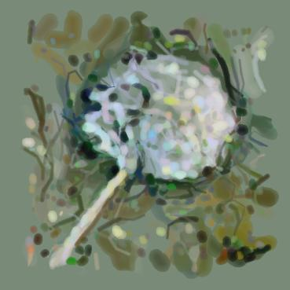
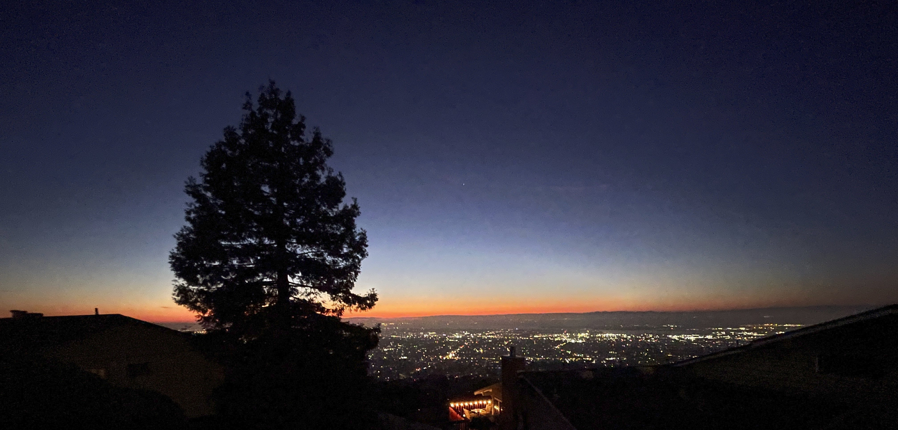
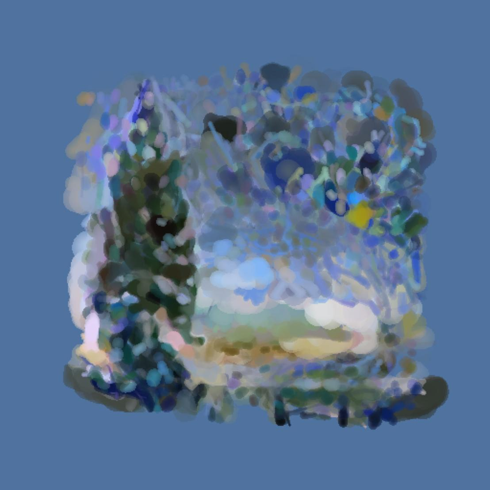
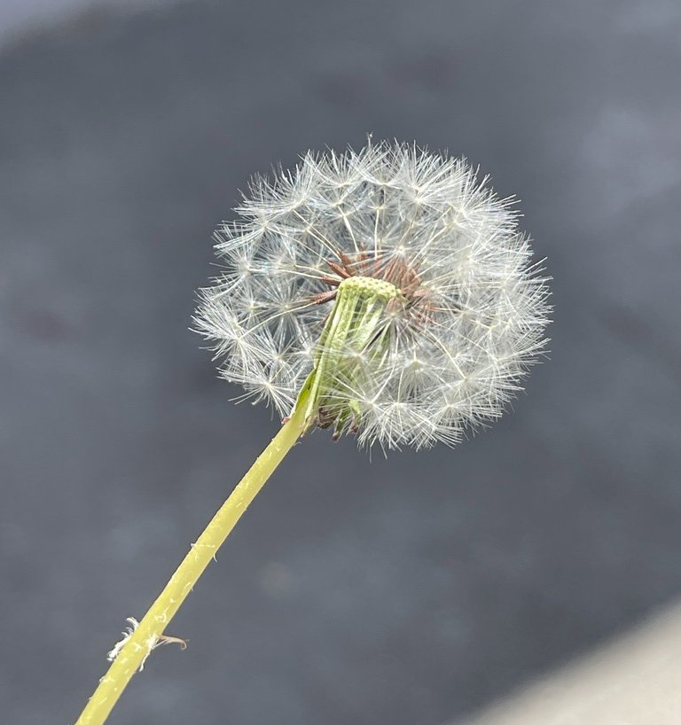
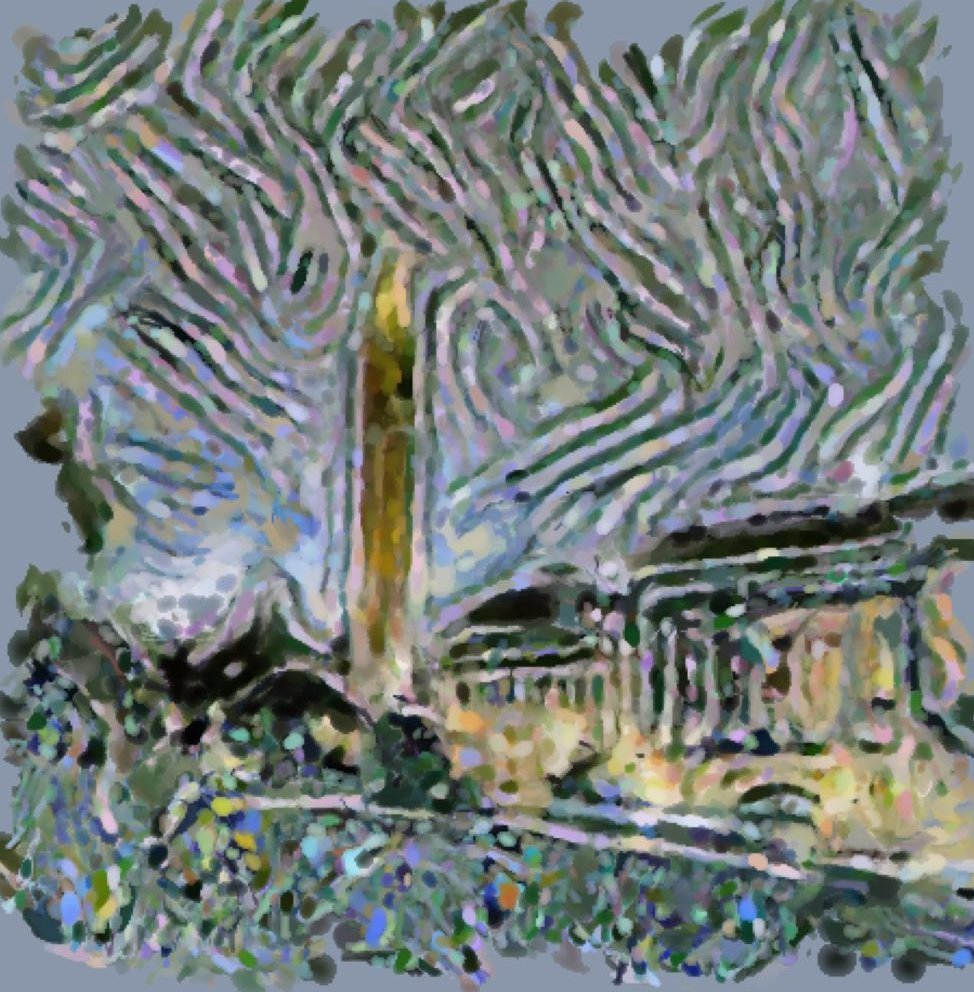

# art_ab_initio

Code for the paper ["Inventing art styles with no artistic training data"](https://arxiv.org/pdf/2305.12015.pdf).

  

## What this repo is about

This repository is a research codebase for making paintings **without training on human-made artworks**. The core idea is that the model learns to paint its artistic representation of a subject (say, a boring photograph) by controlling the artistic tool (the digital paintbrush) to create an image that it can decode back into the original subject. The artistic style comes from trying to encode the information of the subject under the constraints of the painting medium. 

The paper proposes two ways to create new visual styles while avoiding artistic training data:

1. **Medium+perception-driven procedure**
   - Train an artist model on natural images only.
   - The model does not directly output pixels; it outputs structured painterly actions that are rendered by a differentiable brush engine.
   - A learned decoder tries to reconstruct the original photograph from the painting, which encourages the painting to remain a recognizable but abstract representation of the subject.

2. **Inspiration-driven procedure**
   - Use a second **natural image** as inspiration.
   - Apply style transfer from the inspiration image onto the subject image to produce an intermediate image the paper calls an **imagination** image.
   - Feed that imagination image into a baseline painting procedure to obtain the final artwork.

In the paper, this setup is meant to give an objective guarantee that the model is not reproducing human art styles from training data.

## Visual examples

### 1) Medium+perception-driven painting

The subject is a photograph, and the output is a painting produced by the learned brush-based artist.

<table>
  <tr>
    <td align="center"><strong>Subject photo</strong></td>
    <td align="center"><strong>Rendered painting</strong></td>
  </tr>
  <tr>
    <td align="center"></td>
    <td align="center"></td>
  </tr>
</table>

Another example from the repository assets:

<table>
  <tr>
    <td align="center"><strong>Subject photo</strong></td>
    <td align="center"><strong>Painting</strong></td>
  </tr>
  <tr>
    <td align="center"></td>
    <td align="center"></td>
  </tr>
</table>

### 2) Inspiration-driven pipeline

For this procedure, the paper uses style transfer only as a way to combine the **content of a subject photo** with the **appearance cues of another natural photo**. The resulting imagination image is then painted by a baseline renderer.

 

 
 

## How the repository maps to the paper

- `art/`: differentiable painting components, including brush geometry, color compositing, neural modules, and training logic.
- `train.py`: trains the **medium+perception-driven** painter on photographs.
- `render_patchwise.py`: applies a trained painter patch-by-patch to render higher-resolution paintings.
- `render_hardcoded.py`: runs a simpler hard-coded baseline used for the **inspiration-driven** pipeline.
- `imagine.sh`: generates imagination images from subject + inspiration pairs using the optional `style_transfer` submodule.
- `pics/`: example subject, inspiration, imagination, and rendered outputs.

If you only want to understand the repository at a high level, the most important split is:

- `train.py` + `art/`: the learned painter from the paper's **medium+perception-driven** method.
- `imagine.sh` + `render_hardcoded.py`: the paper's **inspiration-driven** method.

This repository is best read as **paper code** rather than a polished package. Reproducing the exact environment today may take extra work because the repo reflects a specific research snapshot from 2023.

## Reference

Nilin Abrahamsen and Jiahao Yao, *Inventing art styles with no artistic training data*.

Paper: https://arxiv.org/pdf/2305.12015.pdf
